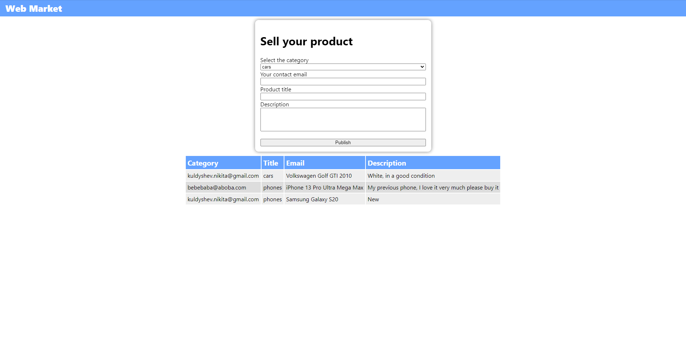

# Lab 4
Этот readme файл является демострацией работы программы для 3 лабораторной работы

Все скриншоты из этого файла находятся в `/docs/` (чтобы их можно было открыть в удобном размере)

Страница до добавления своего товара


Таблица после добавления своего товара


Страница после добавления своего товара


Ссылка на таблицу-результат:
https://docs.google.com/spreadsheets/d/1bKXPauAFhzRgPlBbTjeXsAt1RMr5CbobKJfHi4Vtc-g/edit?pli=1#gid=0

В целях безопасности файл `credentials.json` скрыт через `.gitignore`. Его структура:
```json
{
  {
  "type": "service_account",
  "project_id": "", // String
  "private_key_id": "", // STring
  "private_key": "", // String
  "client_email": "", // String
  "client_id": "", // String
  "auth_uri": "https://accounts.google.com/o/oauth2/auth",
  "token_uri": "https://oauth2.googleapis.com/token",
  "auth_provider_x509_cert_url": "https://www.googleapis.com/oauth2/v1/certs",
  "client_x509_cert_url": "", // String
  "universe_domain": "googleapis.com"
}

}
```