# Lab 3
Этот readme файл является демострацией работы программы для 3 лабораторной работы

Все скриншоты из этого файла находятся в `/docs/` (чтобы их можно было открыть в удобном размере)

По умолчанию index страница выглядит как страница с кнопками для навигации по заданиям
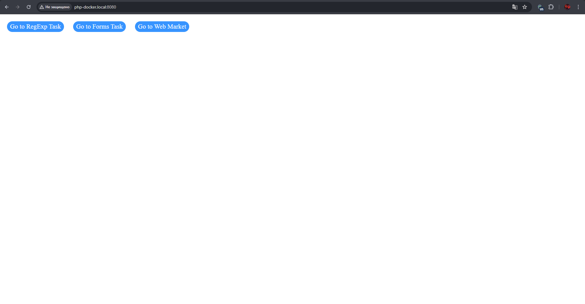

## Задание 1 | RegExp
Результат работы находится по адресу **php-docker.local:8080/regexp.php**
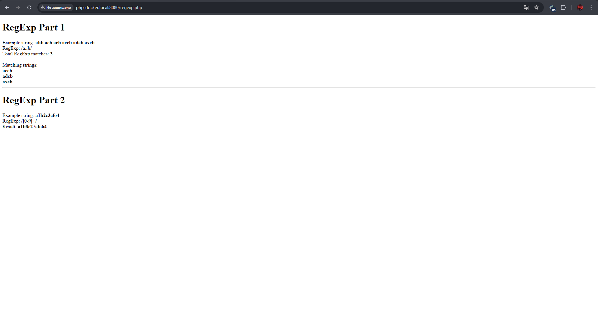

## Задание 2 | Форма, сессии и куки
Все формы находятся по адресу **php-docker.local:8080/forms.php**
### Часть 1
Данные для обработки первым алгоритмом задания вводятся в окно **Task 1 Form**

Требуется ввести любой текст, в котором необходимо посчитать количество слов и символов
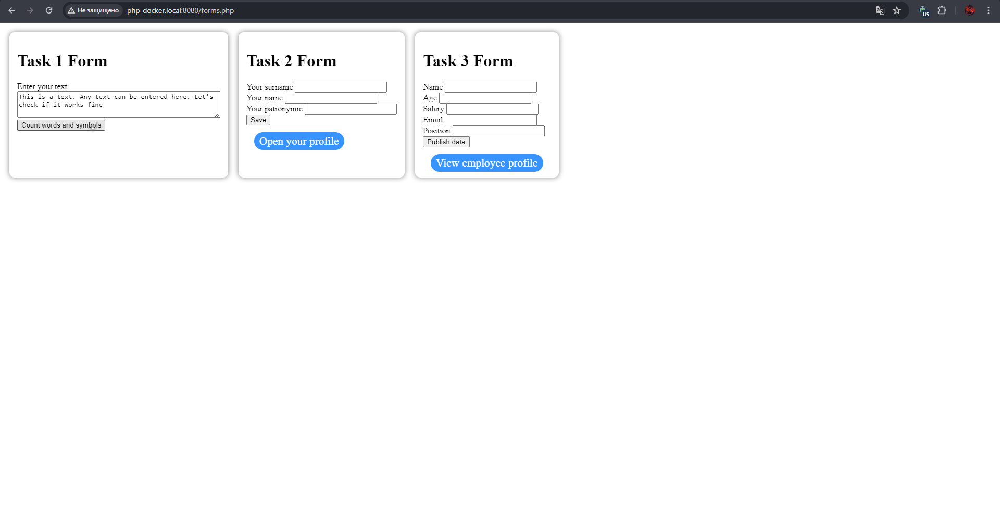
Результат обработки текста
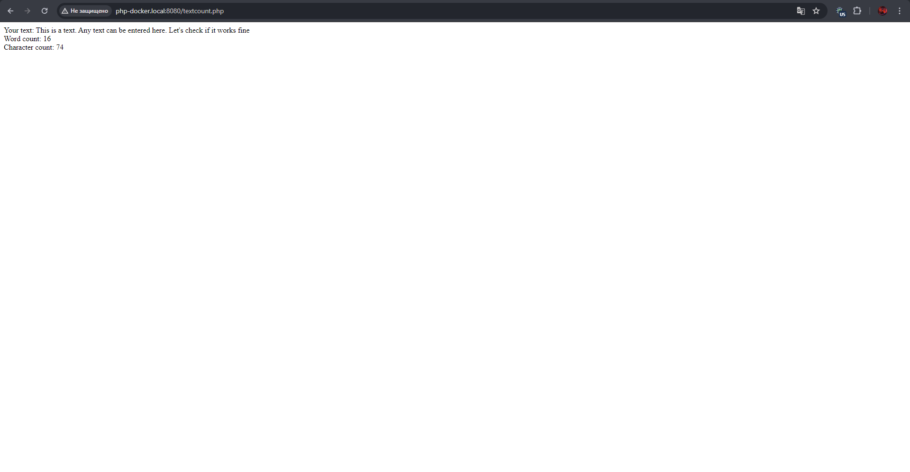

### Часть 2
Данные для обработки вводятся в окно **Task 2 Form**

Требуется ввести фамилию, имя и отчество отедльно в каждое поле
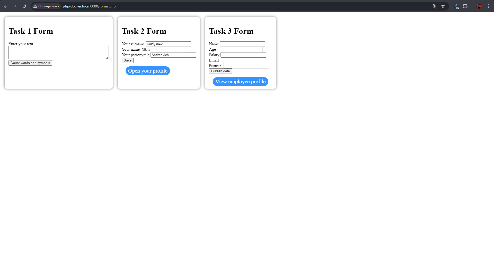
Результат обработки данных показывается на отдельной странице **php-docker.local:8080/profile.php**. Перейти на эту страницу можно с помощью кнопки **Open your profile** в окне формы. Если открыть страницу до использования формы, то будет автоматическая переадресация на страницу с формами

Результат обработки данных формы
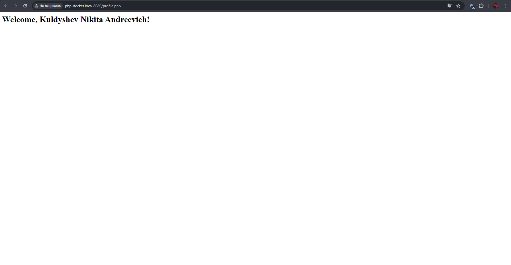

### Часть 3
Данные для обработки вводятся в окно **Task 3 Form**

Требуется ввести имя, возраст, зарплату, почту и должность сотрудника. Код удобно преобразовать для создания массива работников и их вывода на отдельной странице (по условиям лабы достаточно создать массив с данными одного человека, так и сделано)
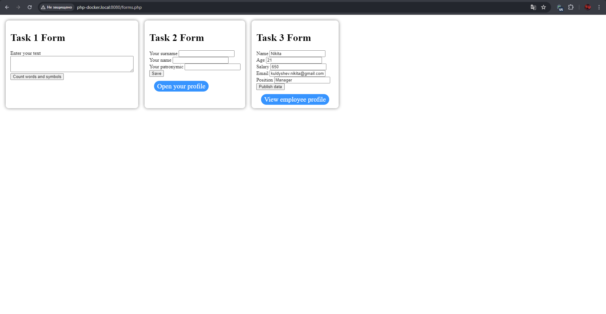
Результат обработки данных показывается на отдельной страницы **php-docker.local:8080/employee-profile.php**. Перейти на эту страницу можно с помощью кнопки **View employee profile** в окне формы. Если открыть страницу до использования формы, то будет автоматическая переадресация на страницу с формами

Результат обработки данных формы
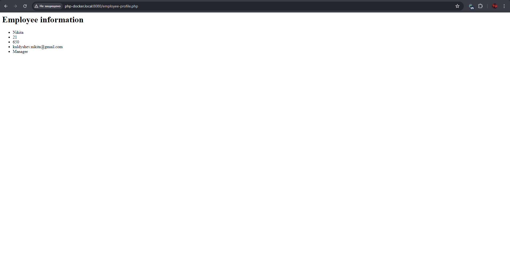

## Задание 3 | Файлы
Результат работы находится по адресу **php-docker.local:8080/market/index.php**

При открытии страницы появляется окно для добавления товара на доску объявлений, а также таблица с текущими обявлениями, хранящимися в папке `/code/market/products/`

При выборе категории в форме, названия категорий берутся из названий папок
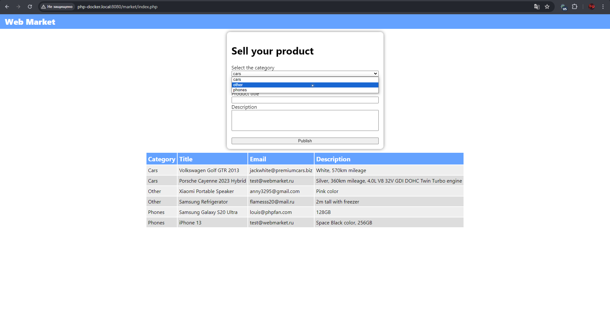

Для отправки формы необходимо заполнить все 4 поля: выбрать категорию, написать почту, название продукта и описание
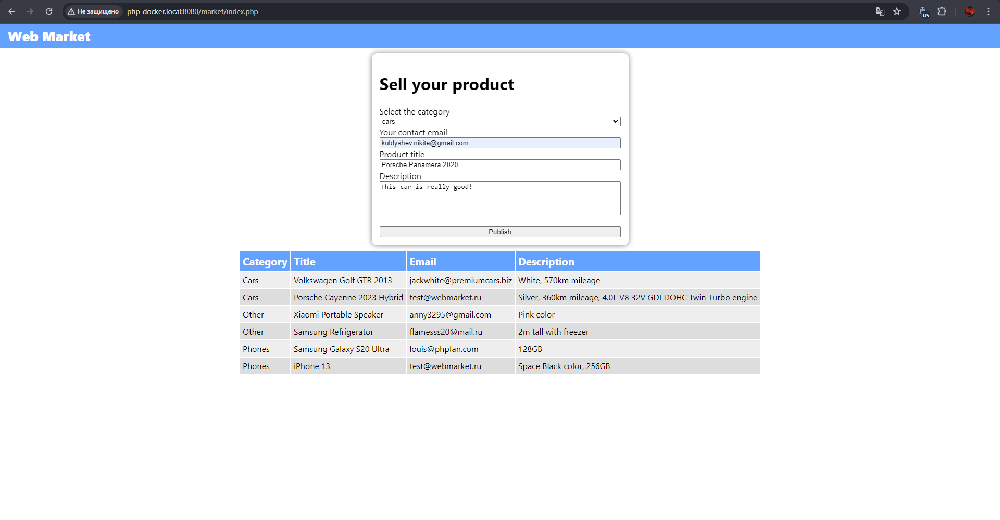

После отправки данных с помощью кнопки **Publish** данные будут сохранены в папку с товарами, а страница обновится, тем самым добавив новый товар в таблицу (а также отобразив новые товары, если они были добавлены другими пользователями с момента открытия страницы нашим пользователем)
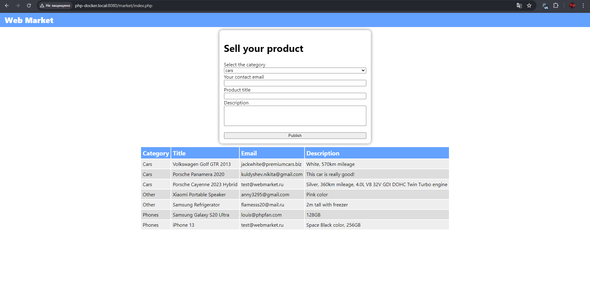